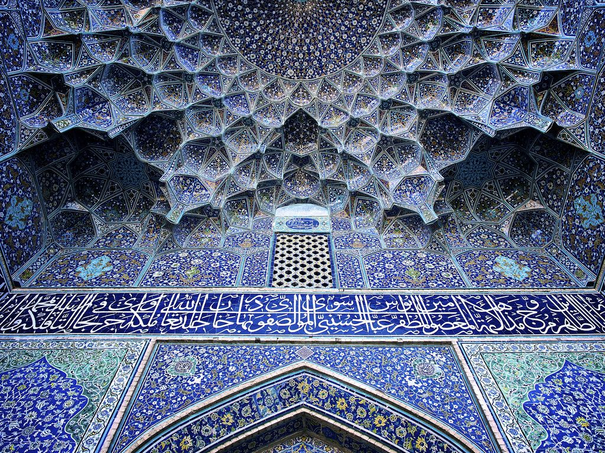

# img2palette

Turning images into '9-pan' palettes using KMeans clustering from sklearn.

## Requirements

We require:
- Pillow, for opening and processing images
- Scikit Learn, for clustering

We use numpy. Since it's a dependency of scikit-learn, we're not specifying it; we're going to use the version that comes with our pinned sklearn version.

On Raspberry Pi, we ran into the error

```
Original error was: libf77blas.so.3: cannot open shared object file: No such file or directory
```

So we did the following:

```
sudo apt-get install libatlas-base-dev
```

The numpy developer documentation recommended either doing that or installing the version of numpy packaged for raspbian. Since we want to use the version of numpy included with sklearn for the least number of dependency headaches, we install libatlas instead.

**If you run into additional issues running the script, please add an Issue with your problem or solution to this repository. If you don't have a solution, I'll do my best to come up with one.**

## Running

We recommend a virtual environment.

```
~$ python3 -m venv venv
~$ source venv/bin/activate
~$ python3 -m pip install -r requirements.txt
```

Once that process is complete, run the program:

```
python3 img2palette.py -i <your image>
```

## Samples

The output is OK. We should tweak the options in the future.

For this image:


We receive this palette:
